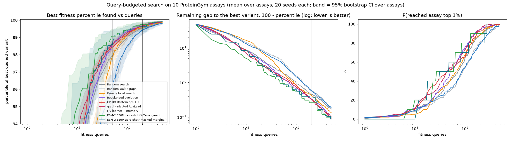

# Better protein representations were not enough. Search strategy was the bottleneck.

A reproducible study of **query-budgeted protein fitness-landscape search** using ESM-2, ProteinGym, fly-inspired sparse coding, Bayesian optimization, evolutionary search and zero-shot protein language models.

**Live site and replayable demo: https://fly-protein.vercel.app**

## 1. Project question

Can a mushroom-body-inspired sparse code (FlyHash) and a reward-gated learner find high-fitness protein variants with only a few lab-style measurements, compared with established search strategies, when every method has the same number of allowed fitness measurements on measured ProteinGym landscapes?

## 2. Headline conclusion

> The representation is useful, but the current fly-inspired learner fails to convert that representation into sample-efficient protein fitness-landscape search.

With 10 unrelated assays × 20 seeds and matched budgets, graph-adapted AdaLead, GP-BO and regularized evolution find top-1% variants far more often than the fly learner at 50–200 measurements, while the fly learner is level with a random walk on the same graph and at or below random search. A zero-shot ESM-2 ranking, which uses no observed fitness to build its ranking, is a strong training-free baseline. Negative results are part of the result.

## 3. Demo

The site replays a recorded run (TEM-1 β-lactamase, seed 0 of 20 fixed in advance, 200 measurements) of the **fly learner vs GP-BO** from the same starting variant. A small procedural fly (three.js) stands on the recorded variant it currently occupies on the landscape map and travels the recorded moves; a circuit view shows, for the variant the learner decides from, its 320 input channels, the real PN→KC wiring into the active Kenyon cells, the sparse code (100 / 2,000 active), the learner's candidate scores, the chosen mutation, the measured fitness and the recorded weight update. GP-BO's panel shows its recorded expected-improvement ranking, predicted fitness and selected query. Every number comes from logged state; the browser re-applies the logged weight updates and checks them against logged statistics and SHA-256 hashes (shown under the demo).

Controls: Start / Pause / Next / Previous / Reset, a timeline scrubber (restarts are marked), direct step entry, speed and a "Stage animation" switch (off, or `prefers-reduced-motion`, shows the settled recorded state at once). Deep link: `#demo-90` opens the replay at measurement 90. *Visual motion is interpolated for presentation; protein variants, neural activations, learner scores, fitness values and state transitions are replayed from recorded benchmark runs.* The fly is a navigation marker, not a simulation of a fly brain, and the 2-D map is a UMAP picture that no method sees.

## 4. Key results

Share of runs that reached the assay's top 1%, mean over 10 assays [95% bootstrap CI over assays]:

| method | 50 measured | 100 | 200 | 500 |
|---|---|---|---|---|
| random search | 40.0 [32.5, 47.5] | 65.0 [56.5, 72.5] | 88.5 [81.5, 94.0] | 100.0 |
| greedy local search | 40.5 [31.0, 50.0] | 67.0 [56.0, 77.5] | 88.5 [85.0, 92.0] | 99.5 |
| regularized evolution | 48.0 [43.5, 53.5] | 75.5 [69.5, 81.0] | 94.0 [88.5, 98.5] | 100.0 |
| GP-BO (Matérn-5/2, EI) | 52.0 [44.0, 60.5] | 65.5 [56.0, 75.5] | 92.5 [87.0, 97.0] | 99.5 |
| graph-adapted AdaLead | 54.5 [47.0, 62.5] | 72.5 [64.5, 80.0] | 94.0 [91.0, 96.5] | 100.0 |
| ESM-2 650M zero-shot (WT-marginal) † | 50.0 [20.0, 80.0] | 80.0 [50.0, 100.0] | 90.0 [70.0, 100.0] | 100.0 |
| **fly learner** | 30.5 [22.0, 38.0] | 51.0 [37.5, 63.5] | 76.5 [65.5, 87.0] | 98.5 |
| fly learner + memory | 31.5 [21.0, 42.5] | 54.5 [44.0, 65.5] | 78.5 [66.5, 88.5] | 98.0 |

† Zero-shot ESM-2 builds its ranking without any observed fitness measurement; the budget counts the top-ranked candidates subsequently measured against the assay.

Paired difference to the fly learner at 50 measurements (points of P(top 1%)): graph-adapted AdaLead +24.0 [15.5, 32.0], GP-BO +21.5 [15.0, 28.0], regularized evolution +17.5 [8.0, 27.0]. All tables, per-assay results, top-0.1%, best-percentile and AUC metrics: [`results/benchmark/tables.md`](results/benchmark/tables.md); write-up: [`results/benchmark/SUMMARY.md`](results/benchmark/SUMMARY.md).

## 5. Main sample-efficiency figure



Random search is itself strong (50 random measurements of ~3k variants already reach the 98th percentile on average), which is why **50–200 measurements is the informative regime**.

## 6. Methodology

- **Landscapes:** 10 ProteinGym DMS substitution assays from 10 unrelated proteins (2.5–5k single mutants each); candidate set = all variants of an assay. Per-assay percentile normalisation; raw scores are never averaged across assays.
- **Budgeted oracle:** a budget counts unique variants whose fitness is measured. Methods receive an `Oracle` and a `Static` object without a fitness field, so the only way to learn a fitness is `oracle.query(i)`; an exhausted budget raises. The evaluator alone reads the landscape afterwards.
- **Matched conditions:** same assay, same shared start variant per (assay, seed), same seeds (20), same candidate set, same search graph for local methods (15-NN in ESM-2 8M embedding space), deterministic logged query sequences.
- **Metrics:** best percentile found vs measurements, P(reach top 1%), P(reach top 0.1%), AUC of the best-percentile curve, per-assay results; unit of replication = assay; 95% bootstrap CIs over assays; paired differences per assay.

## 7. Baselines

| method | what it may see |
|---|---|
| random search / random walk | nothing / the graph |
| greedy local search | graph + fitness of queried variants (steepest ascent, random restart) |
| regularized evolution | population of queried variants on the graph |
| GP-BO | PCA-50 of the cached embeddings + queried fitness; exact GP, Matérn-5/2, EI |
| graph-adapted AdaLead | as GP-BO's surrogate; **not the published implementation** (mutation = move to a graph neighbour, no recombination, GP-mean surrogate, κ = 0.05, batch 10) |
| zero-shot ESM-2 | sequence only: WT-marginal (8M/150M/650M) and masked-marginal (8M/150M) log-probability ratios |
| fly learner (+memory, best tested) | graph + FlyHash codes + reward of the variants it moves to |

## 8. Architecture

```
src/flyprotein/
  flyhash.py      FlyHash sparse expansion code        embed.py       ESM-2 / k-mer embedders
  connectome.py   hemibrain PN->KC edges (neuPrint)    navigate.py    walker port used by the ablations
  bench/          oracle.py (budgeted oracle) data.py methods.py gpbo.py adalead.py metrics.py
scripts/          embed_*.py zeroshot_scores.py run_benchmark.py analyze_*.py verify_replay.py make_manifest.py export_*.py
results/          benchmark/ ablation/ learner/ transfer/ hemibrain/ MANIFEST.json   (all committed)
web/              TypeScript + Vite static site; replays recorded state (src/demo: state.ts one immutable StepView per step,
                  store.ts the single current step, choreo.ts presentation timing, gfx/ three.js landscape+fly+circuit, Canvas 2D fallback)
tests/            pytest (accounting, determinism, replay, learning rule)    web/src/demo/*.test.ts (vitest)
```

## 9. Reproduction

```bash
python -m venv .venv && source .venv/bin/activate
pip install -e ".[esm,connectome,analysis,dev]"
# download ProteinGym DMS substitution parquet shards to data/proteingym/DMS_substitutions/
python scripts/embed_assays.py                 # ESM-2 8M embeddings (CPU, ~8 min)
python scripts/prepare_benchmark_data.py
python scripts/zeroshot_scores.py --model facebook/esm2_t33_650M_UR50D --mode wt   # also 8M/150M, --mode mm
python scripts/run_benchmark.py --seeds 20 --budget 500
python scripts/analyze_benchmark.py            # tables, plots, summary.json
python scripts/verify_replay.py                # re-runs jobs, compares to results/benchmark/queries.npz
python scripts/make_manifest.py                # revisions + SHA-256 of every key artifact
python scripts/export_demo_circuit.py          # (display only) PN->KC wiring, KC drive and move probabilities for the demo's circuit view
pytest && (cd web && npm ci && npm test && npm run build)
```

`results/MANIFEST.json` records assay IDs, model and dataset revisions, seeds, budgets, per-method configuration hashes and artifact SHA-256. The site's data files are generated by `scripts/export_web_results.py` and `scripts/export_demo_trace.py` from the committed result files; the latter asserts that the traced demo runs are identical to the benchmark's logs.

## 10. Ablations

| study | question | outcome |
|---|---|---|
| [representation](results/ablation/SUMMARY.md) | ESM-2 8M/150M/650M × input dim × Kenyon cells × sparsity, dense cosine / SimHash / FlyHash | the signal is there and FlyHash keeps most of it; compression was not the cause |
| [learner sweep](results/learner/SUMMARY.md) | learning rate, temperature, absolute rule, replay | no reliable improvement |
| [cross-assay pretraining](results/transfer/SUMMARY.md) | leave-one-assay-out transfer of the learner's weights | weak positive ranking signal, no navigation gain, often harmful |
| [hemibrain wiring](results/hemibrain/SUMMARY.md) | real PN→KC synapse counts vs random wiring | slightly worse, no navigation advantage |

## 11. Negative results

- Cross-assay pretraining produced weak but consistently positive held-out ranking signal (Spearman 0.04–0.14), yet failed to improve query-budgeted navigation and often harmed it. Weak transferable ranking information is insufficient for effective sequential search under the current learner.
- Real hemibrain wiring gave no measurable advantage over random wiring.
- Larger ESM-2 models improve neighbourhood quality but not the fly learner's navigation gain.
- Memory helps the fly learner somewhat but does not make it competitive; tuning the learner did not help reliably.

## 12. Limitations

10 assays (mostly growth/stability phenotypes); wide assay-level CIs for the deterministic zero-shot rankings; search methods use ESM-2 8M embeddings while zero-shot goes to 650M (masked-marginal run for 8M and 150M only); graph-adapted AdaLead, GP-BO and regularized evolution use fixed, untuned settings; the fly learner's best configuration was chosen earlier on one landscape; the demo's 2-D map is a UMAP picture that no method sees. This is an in-silico benchmark, not drug discovery or wet-lab validation, and not a simulation of a fly brain.

## 13. Literature / related work

- Lin et al., *Evolutionary-scale prediction of atomic-level protein structure with a language model* (ESM-2), Science 2023.
- Notin et al., *ProteinGym: Large-Scale Benchmarks for Protein Fitness Prediction and Design*, NeurIPS Datasets & Benchmarks 2023.
- Meier et al., *Language models enable zero-shot prediction of the effects of mutations on protein function*, NeurIPS 2021 (wild-type and masked marginals).
- Sinai et al., *AdaLead: A simple and robust adaptive greedy search algorithm for sequence design*, arXiv:2010.02141, 2020.
- Real et al., *Regularized Evolution for Image Classifier Architecture Search*, AAAI 2019.
- Romero, Krause, Arnold, *Navigating the protein fitness landscape with Gaussian processes*, PNAS 2013.
- Dasgupta, Stevens, Navlakha, *A neural algorithm for a fundamental computing problem* (FlyHash), Science 2017.
- Scheffer et al., *A connectome and analysis of the adult Drosophila central brain* (hemibrain), eLife 2020.

## 14. Deployment

Static site (`web/`, Vite build) deployed on Vercel: https://fly-protein.vercel.app

## 15. License

MIT (see `LICENSE`).

*Development note: built with AI coding assistance (Claude Code); the study design, results and conclusions are documented in this repository.*
